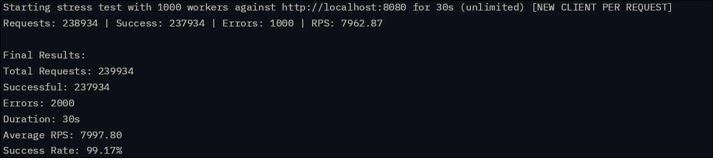

<h1 align="center">⚙️ C++ Webserver from Scratch</h1>
<p align="center"><em>"just use express bro..."</em></p>

<p align="center">
  
  
  
</p>


This is a learning project that evolved into a fully functional, non-blocking, event-driven web server capable of handling thousands of concurrent connections.

---

## Performance
Metrics:

Stress test using Go:
```bash
go get golang.org/x/time/rate
go run stresst.go
````

---

## Key Features

* **Reactor Pattern Architecture** – Event-driven design for maximum efficiency
* **Non-blocking I/O** – Using Linux's `epoll` for scalable event notification
* **Custom Minimal Thread Pool** – Optimal resource utilization with worker threads
* **HTTP/1.1 Support** – With keep-alive and proper connection handling
* **Custom Buffer System** – For efficient memory management
* **Edge-Triggered Epoll** – For maximum performance

---

## 📦 Project Structure

```
shhh/
├── include/              # Header files
│   ├── buffer.hpp
│   ├── connection.hpp
│   ├── epoll.hpp
│   ├── net_utils.hpp
│   ├── request.hpp
│   ├── response.hpp
│   ├── server.hpp
│   └── socket.hpp
├── src/                  # Implementation files
│   ├── buffer.cpp        
│   ├── connection.cpp    
│   ├── epoll.cpp         
│   ├── main.cpp          
│   ├── request.cpp       
│   ├── response.cpp      
│   ├── server.cpp        
│   └── socket.cpp        
└── public/               # Static web content
```

---

## 🧰 Getting Started

### ✅ Prerequisites

* Linux (uses `epoll`)
* C++17 compiler (`g++` or `clang++`)
* `make`
* Optional: `CMake`

### 🔧 Building

```bash
cd src/
make
```

### ▶️ Running
#### Without docker !!!(CHECK MAIN.CPP)!!!

```bash
./server <port> <source_directory>

# Example:
./server 8080 ../public
```

#### With docker (recommended)
```bash
./deploy.sh
```

---

## 🏗️ Architecture Deep Dive

### 🌀 The Reactor Pattern

The server follows the **Reactor pattern** with the following components:

* **Event Demultiplexer**: `epoll` for monitoring file descriptors
* **Dispatcher**: Main thread that handles `epoll` events
* **Request Handlers**: Worker threads that process I/O operations

### ⚙️ Performance Optimizations

* **Edge-triggered epoll**: Only notified on state changes
* **`accept4` with `SOCK_NONBLOCK`**: Avoids extra `fcntl` calls
* **Thread-safe buffer**: Lock-free where possible, otherwise mutex-protected
* **Connection pooling**: Reuses connections via HTTP keep-alive

---
---

## 📚 Learning Journey

This project represents my deep dive into:

* Linux system programming
* Network programming
* Concurrent programming in C++
* Performance optimization

---

## 🤝 Contributing

While this is primarily a learning project, I welcome:

* Bug reports
* Performance improvement suggestions
* Educational discussions about the implementation

---

## 📜 License

MIT License – see [LICENSE](./LICENSE) for details.
