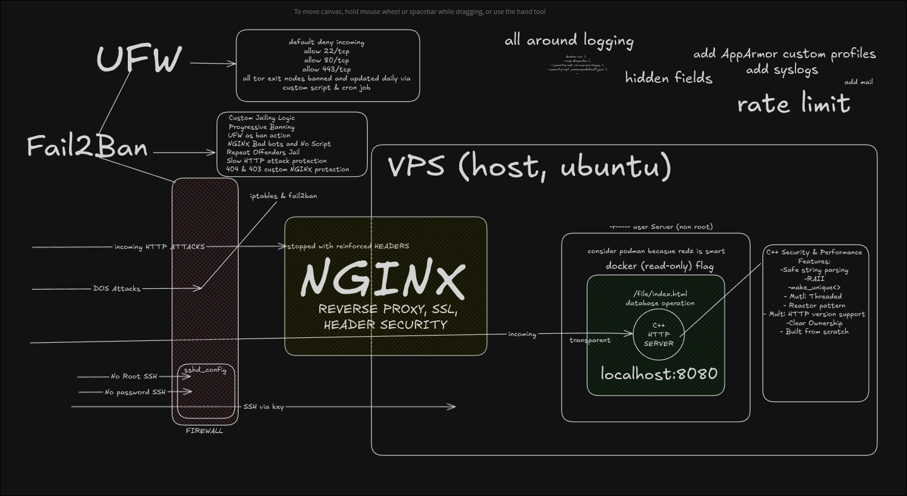

## C++ Webserver Built From Scratch

#### This server follows a multi-threaded Reactor pattern, using non-blocking sockets from the Linux API. Serving HTML CSS JS bundles, aswell as popular framework build files.
IMPORTANT: THIS PROJECT IS A WORK IN PROGRESS
Currently single-threaded.
Non blocking epoll, with nonblocking accept4 for sockets and Edge-triggered event driven architecture.
A docker read-only image is coming by the end of the week, aswell as the full threat model + mitigation strategy. This webserver will be used to host my portfolio website. But it will also be reusable in any other way!

The server is currently framework agnostic (no SSR implemented, so you will have to export Nextjs/Sveltekit build files and then move them to public dir)
Works with pictures, videos, audio sources, favicon.ico, htmls, css, js...

#### Usage
```
cd src/
make
./server <port> <src-dir>
```

Stay tuned!

## PERFORMANCE


Quick little diagram to not leave you hanging:


